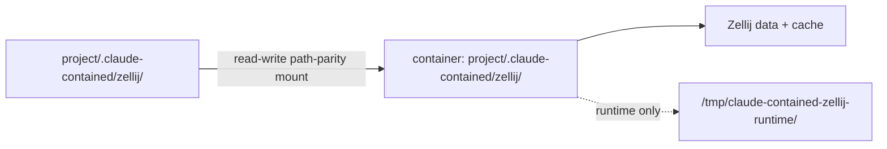

# Zellij Session Store

Zellij support is opt-in through `--zellij`. The launcher makes Zellij the top-level container command, with the selected container command or `bash` passed as the initial pane command. The entrypoint still applies the srt sandbox around Zellij unless `--no-sandbox` is set.

The Zellij session store is `<project-dir>/.claude-contained/zellij/`. Keeping it with the project prevents unrelated checkouts from sharing resurrection metadata and makes the state follow a project when its whole directory is moved or backed up. The launcher creates `data/` and `cache/` on the host, mounts the store read-write at path parity, and passes that absolute root to the image. This writable child mount is the intentional exception beneath the otherwise read-only project `.claude-contained/` mount from [ADR-0010](0010-project-claude-contained-read-only.md).

Zellij data and cache persist in the project store, but a new launcher run removes saved metadata for the target session before creating the generated initial layout. This keeps stale panes, such as a shell dropped from an earlier failed launch, from overriding the current container command. Runtime sockets stay container-local because `XDG_RUNTIME_DIR` is set to `/tmp/claude-contained-zellij-runtime/`; Zellij then creates its versioned socket tree there, avoiding stale host socket reuse and keeping attach scoped to the live container. Marked Zellij runs enable `allowAllUnixSockets` under the Linux srt backend because path-specific Unix socket allowlisting is not available there.

The previous `~/.claude-contained/zellij/` store is neither read nor migrated by a current launcher and is never deleted automatically. Automatic migration was rejected because one global store can contain metadata for several projects, so the launcher cannot assign its contents to one project without guessing. A user who needs old resurrection data can copy the store into the relevant project before removing the original.

Detaching from Zellij must not end the launcher. `zellij-run` waits until `zellij list-sessions --no-formatting` no longer reports the session as live, treating `(EXITED` sessions as not live. That keeps the container and any worktree locks alive while panes can still run project commands.

The launcher marks Zellij containers with `CLAUDE_CONTAINED_ZELLIJ=1`, `CLAUDE_CONTAINED_ZELLIJ_SESSION=<session>`, and `CLAUDE_CONTAINED_ZELLIJ_ROOT=<project-store>`. Docker also receives labels, but env inspection is the portable source of truth because Apple Containers and Docker expose env consistently enough through inspect output.
