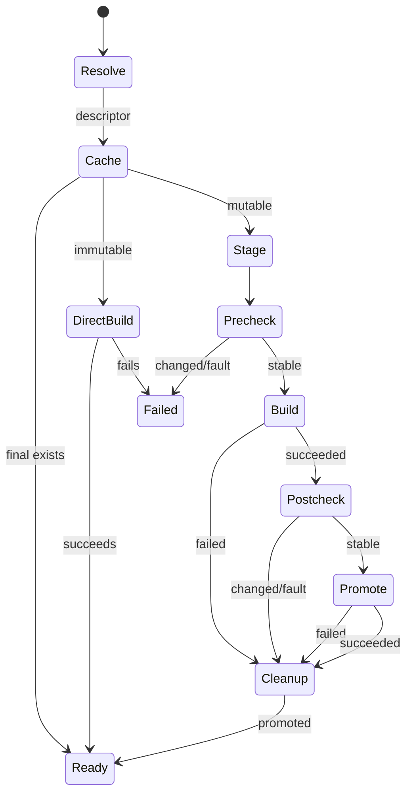

# Tooling-Layer Builder References

## Decision

The runtime reports an image descriptor with a stable `Identity`, a
builder-resolvable `BuildRef`, and whether that build reference is immutable.
Derived-image hashes, tags, invalidation, and provenance use only `Identity`.
`BASE_IMAGE` receives only `BuildRef`.

Docker's resolved identity remains both values and is immutable. Apple
Containers keeps its manifest digest as identity, but uses the original local
tag as a mutable builder reference unless a version-specific live probe has
verified that a local `name:tag@sha256:...` reference resolves without registry
access. Apple never passes a standalone `sha256:...` value to `FROM`.

The settled Apple Containers 1.1.0 (5973b9c) probe found that
`claude-contained:latest@sha256:6e8982122194ccb81a0ae9157e21a5318e37c4da1436b29d4e580985af3fba67`
attempted Docker Hub and failed 401. It is therefore an unverified, mutable
case.

For a mutable reference, the launcher builds to a cryptographically random
staging tag, checks the base identity immediately before and after the build,
then promotes only the stage to the final tag. It removes that exact stage on
every path. Cleanup failure is a warning: it preserves a primary failure, or
leaves a successfully promoted final image runnable.

## Consequences

The derived tag remains a content hash over base identity and layer context;
staging tags never enter provenance. Concurrent stable builds may race to the
same final tag, retaining ADR-0006's accepted last-writer behavior. Pre/post
checks cannot detect an ABA mutation of the local tag, which is documented
rather than hidden. No error path runs the base image as a fallback.

Using standalone digests was rejected because Apple treats them as Docker Hub
image names. Named digest references remain opt-in: they need a live probe for
the exact supported runtime version before replacing the guarded local-tag
path.
