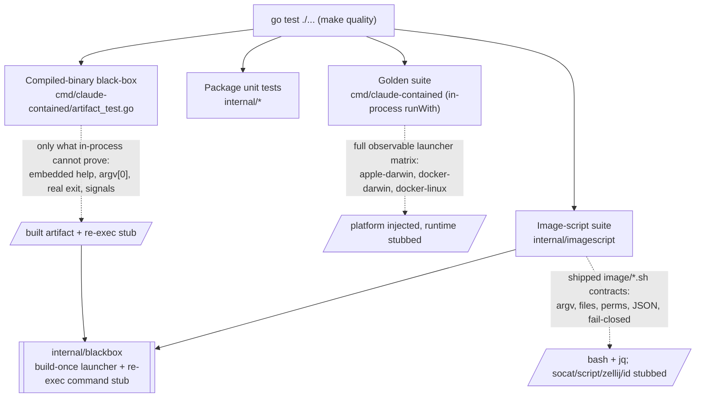

# Go Owns the Tests, With a Compiled-Binary Black-Box Boundary

The launcher is a single Go binary ([ADR-0004](0004-go-launcher-rewrite.md)), but
its test orchestration was still shell: `tests/*.test.sh` drove the built binary
through `mktemp`/`rm -rf` scratch trees, on-PATH stub scripts, and process
plumbing written in bash. That split cost real coverage safety — a bare
`mktemp -d` that fails into an empty string turns a later `cd`+`pwd -P` into the
repository root, which a `rm -rf` then deletes (the footgun `tests/lib/tmp.sh`
exists to guard) — and it kept whole categories of assertions outside the
deterministic `make quality` gate, which runs `go test ./...` but not the shell
harness. Test orchestration has moved into Go without changing production
behavior or losing observable coverage. This decision records the lasting shape.
The migration ran across several pull requests, each of which added or verified
equivalent Go coverage, deleted the shell cases it replaced, and left
`make quality` green; the final one removed the last `tests/*.test.sh`,
`tests/lib/tmp.sh`, and the `make test-shell` target. No `tests/` shell harness
remains -- `go test ./...` runs everything, and scratch state uses Go's
`t.TempDir()`, so the `mktemp`-into-empty-string footgun `tests/lib/tmp.sh`
guarded against cannot recur.

## Three suites, drawn on what each can prove

The [golden suite](0004-go-launcher-rewrite.md) drives `runWith` **in process**
with the host platform injected, because that is the only way all three
runtime/platform configurations (`apple-darwin`, `docker-darwin`,
`docker-linux`) are reachable from either host — a subprocess reads the real
`GOOS`, and Apple Containers is unselectable off macOS. It stays the canonical
full observable matrix.

Everything an in-process call *cannot* prove is what the compiled-binary
black-box suite (`cmd/claude-contained/artifact_test.go`) covers, and only that:
the built artifact embeds and emits the help text verbatim, selects its runtime
from `argv[0]`, propagates a real child's exit status, and gives its foreground
child the correct signal disposition. This boundary is deliberate. Signal
inheritance is the sharpest example — it depends on what a real child process
observes across `execve` when the launcher receives a real signal, which no
in-process test can reach. Exact CLI error text and the two-pass runtime
selection grammar, by contrast, are fully provable in process (`internal/cli`,
`cmd/claude-contained/selection_test.go`), so they stay there rather than being
re-proven against a subprocess.

The third suite is the image scripts. The container image still ships small
shell scripts under `image/` that run inside the image where bash is a given
(port forwarding, the srt sandbox-policy generator, the tool-environment
resolver, the debug-shell PTY wrapper, the Claude native-link creator, the
Zellij wrappers). These have no owning Go package, so — exactly as the
compiled-binary suite lives in `cmd/claude-contained` — their tests live in a
dedicated `internal/imagescript` package, which runs each real `image/*.sh`
under `bash` and asserts its observable contract structurally: the argv of the
external commands it drives, the files and permissions it produces, the JSON
policy it generates, and its fail-closed behavior on bad input. Where shell
interpretation itself is the contract (the tool-env layer fragments), small
checked-in fixtures live under `internal/imagescript/testdata/`; no substantial
shell program is embedded in Go strings.

This revises one sentence of ADR-0004 — "the shell suites under `tests/` are what
exercise the shipped binary end to end." The compiled-binary and image-script Go
suites now own that role for the properties above, and both run inside
`make quality`. No `tests/*.test.sh` remains.

## The harness: build once, re-exec as the stub, synchronize on readiness

The shared harness is `internal/blackbox`, a normal package (not `_test.go`) so
several test packages can import it. It is never imported by production, so it
never links into the shipped launcher, and it imports `testing` for its
`testing.TB` helpers — the standard test-support-package shape.

Three pieces are worth recording because they are not obvious from the code:

- **The launcher is built once per test process into an isolated temporary
  directory**, with the `-docked` compatibility symlink created beside it, and is
  never a pre-existing `bin/claude-contained`. A stale build output can no longer
  make a green test lie about current source.

- **The command stub is this test binary re-executed under a command name.** A
  test package's `TestMain` calls `blackbox.RunStubIfInvoked`; the harness
  symlinks the command names (`docker`/`container` for the launcher suite,
  `socat`/`script`/`zellij`/`id` for the image-script suite) to the test binary
  on a PATH it controls; the launcher or the image script execs those symlinks.
  Stub mode is entered only when `BLACKBOX_STUB_SPEC` is set, which happens
  exclusively in a subprocess's inherited environment and never in the go-test
  parent, so an ordinary run is unaffected. The stub records each invocation
  (argv and process identity) as one JSON line, so a test asserts the command's
  argument boundary structurally rather than by scraping a log format. A separate
  compiled stub program was rejected: it would add a stray `main` package to the
  tree and a second build step, where re-exec reuses the binary `go test` already
  built. Serving the image-script suite needed two additive, backward-compatible
  extensions: a *contains-match* arm (some commands, e.g. `zellij --config X
  --data-dir Y list-sessions`, carry their discriminating subcommand past
  `argv[0]`, where an exact match cannot reach it) and optional *environment
  capture* (to prove a script exported a variable — the `PRE_ZELLIJ_*` PATH/SHELL
  stash — into the command it invoked). Both default off, so the launcher suite
  is unchanged.

- **Process tests synchronize on observable readiness, never a production-length
  sleep.** A stubbed run signals a ready marker and then blocks on a FIFO; the
  harness releases it by opening the other end. The group signal case needs no
  release — the child dies of the signal's default disposition while blocked, so
  a launcher that wrongly handed it an *ignored* disposition would hang the whole
  run and trip a hang guard, a strictly stronger and sleepless assertion than the
  retired suite's timed sleep. Real-time deadlines survive only as hang guards.

## Bash and jq remain contributor prerequisites; git is a fixture dependency

The image-script suite runs the shipped `image/*.sh` under a real `bash` and
lets `srt-settings.sh` generate its policy with the real `jq`, because those are
the interpreters the scripts genuinely depend on and stubbing them would test a
fiction. Both fail the test clearly (never `t.Skip`) when absent: a missing
prerequisite is a contributor-environment error, not silently dropped coverage.
The external commands whose *argument boundary* rather than implementation is
under test (`socat`, `script`, `zellij`, `id`) are stubbed instead, so the gate
needs none of them installed.

Likewise, the stubbed runtimes are Go, but the harness process tests still build
real git worktree fixtures and read `git worktree list --porcelain`, exactly as
the golden suite already does. `git` is not a container runtime, so the gate's
"no running container runtime" guarantee holds; a missing `git` is a contributor
environment error, not a launcher one.
