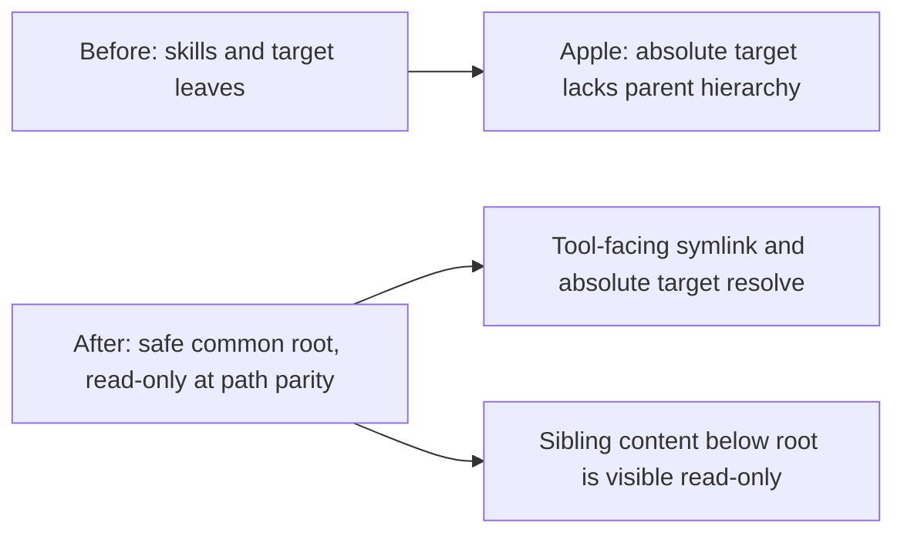

# Shared Skills Target Root

Status: accepted

`--share-skills` mounts a shared directory at each tool's skills destination
and replays resolved targets at their original paths. That leaf-only shape was
not sufficient for Apple Containers when a directory symlink points outside the
shared directory: the target may be mounted, but its absolute path has no usable
parent hierarchy. This decision records the deliberately broader, read-only
exposure used to make those links work.

## Decision

For a shared skills directory with resolved external targets, the planner
derives the smallest component-wise common ancestor of the directory and those
targets. It mounts that **shared skills target root** read-only at path parity
when it is safe: it cannot be a filesystem or volume root, cannot already be
covered by a path-parity mount, and cannot contain an existing mount
destination that a later parent mount would shadow. Otherwise the launcher
retains the prior source/leaf replay.

Only `src == dst` mounts cover host absolute paths. A writable parity ancestor
provides hierarchy but does not replace the read-only overlays; a non-parity
mount provides neither kind of coverage for an absolute target.

## Alternatives considered

- **Leaf-only target mounts:** rejected because Apple Containers needs a usable
  parent hierarchy for absolute directory symlinks.
- **Require a manual `-m`:** rejected for the common shared-repository layout;
  users can still use `-m SAFE_PARENT:ro` where the automatic guard falls back.
- **Apple-only behavior:** rejected because path-parity mount planning is shared
  by both runtimes and should not branch above the runtime seam.
- **Any common ancestor, including `/`:** rejected as unacceptable isolation
  widening.
- **Safe common root with parity and overlap guards:** chosen. It keeps the
  hierarchy as narrow as path derivation permits, preserves existing ordering
  and exact-conflict behavior, and falls back rather than adding an error when
  an unsafe layout prevents optimization.

## Consequences

The read-only target root can expose sibling files below that ancestor. This is
an intentional isolation tradeoff, described operationally in
[USAGE.md](../../USAGE.md#behavior). The probe/run race around filesystem
changes remains unchanged: target facts are resolved before runtime execution.
