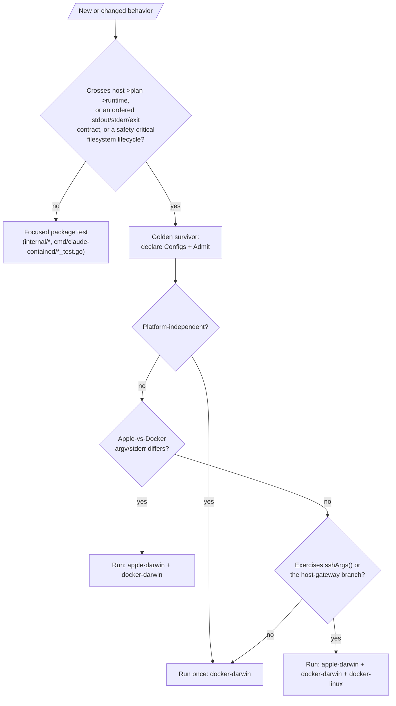

# Curated Golden Contract Matrix

Status: accepted

The golden suite in `cmd/claude-contained` (ADR-0004, ADR-0008) rendered every
one of 68 behavior scenarios across all three runtime/platform configurations
(`apple-darwin`, `docker-darwin`, `docker-linux`) — a full Cartesian matrix of
204 committed fixture files. That shape was justified only while it proved
Go-vs-Bash equivalence during the launcher rewrite: ticket 11's gate had to
pass clean across the whole differential corpus on both runtimes before the
bash launchers could be deleted. The Bash launchers are gone, so the
equivalence purpose has expired, and the Cartesian shape kept paying its full
cost — 47.339s of local wall time, most of it re-observing the same
platform-independent behavior three times — for no corresponding safety gain
in most cases. This decision replaces it with a small, behavior-driven, sparse
assembled-contract suite of 12 scenarios and 19 fixtures.

## Decision

A golden survives only where a full run crosses ownership boundaries (host →
plan → runtime), where ordered user-visible output plus exit status form one
contract, or where a safety-critical filesystem lifecycle is not economically
proved by a focused test. Everything else — narrow parsing, validation,
precedence, rendering, flag-permutation behavior — is owned by focused package
tests, which already existed for almost every removed scenario; the six that
did not (the `-p` port-publish argv, `--allow-host`'s `SRT_ALLOW_HOSTS`
assembly, `--share-host-claude`'s mount contract, and the read-only
project-directory rejection) gained one in the same pull request that removed
their golden.

Each surviving scenario runs **only** in the configurations that can expose a
*distinct* contract, declared beside the scenario as `Configs` plus a
non-empty one-line `Admit` reason:

1. Platform-independent assembled behavior runs **once**, on `docker-darwin`
   — the runtime CI actually runs, and the plainer argv builder.
2. Runtime-sensitive behavior runs on the relevant runtimes (`apple-darwin` +
   `docker-darwin`) whenever the Apple-vs-Docker argv/stderr contract differs.
3. `docker-linux` is admitted **only** for a scenario that exercises a named
   Linux-only platform branch. `internal/runtime/docker.go` has exactly two:
   `sshArgs()`'s three-way split (Apple bridged; Docker-Darwin's fixed
   `/ssh-agent` path; Docker-Linux binding the real `$SSH_AUTH_SOCK`), and the
   `--add-host host.docker.internal:host-gateway` argument appended only when
   the platform is Linux. Everything else on `docker-linux` re-observes
   `docker-darwin`.
4. Future goldens require an explicit cross-boundary or config-specific
   admission reason. Public features and bug fixes do **not** get a golden
   automatically; a focused test is the default.

## Harness enforcement

`goldenCase` gained `Configs []string` and `Admit string`, replacing the
single-purpose `HostGOOS` field the retired node_modules-overlay scenario
used. `TestGolden` iterates each case's own `Configs` against a
`goldenTreeByName` lookup rather than the full `goldenTrees` Cartesian
product. `TestGoldenMatrixIsWellFormed` makes the admission rule executable:
it fails on an empty `Configs`, an unknown or duplicate config name, or an
empty `Admit`, so a new survivor cannot silently opt out of declaring its
risk and a typo cannot silently write to `testdata/golden//<slug>.txt`.

The rendered five-section golden file format is unchanged — the admission
reason lives beside the scenario in Go, not in the fixture. Every surviving
`(scenario, tree)` file is therefore byte-identical to what it was before this
change; the pull request that introduced this decision only *deleted* files,
never regenerated one. That keeps CONTRIBUTING.md's "a changed golden is a
behavior change" rule clean: nothing changed, things were removed.

## The node_modules overlay refactor

The retired `49-node-modules-overlay` scenario gated on `runtime.GOOS` at
**compile time** in `cmd/claude-contained/probe.go`, so it only ever ran on
the darwin arm of the matrix and was silently skipped everywhere else —
including CI's Linux runner, the one host `make quality` actually protects.
A host-dependent golden gating a host-dependent code path is not a safety net
at all on the host that matters. The overlay-candidate computation was
extracted into `nodeOverlayCandidates(hostGOOS, arch, projectDir,
extraMounts, extraModes)`, a pure function that takes the host OS as a
parameter instead of reading `runtime.GOOS` itself; `probeFacts` is now the
only call site, passing `runtime.GOOS` through unchanged (a pure extraction,
matching the "host platform is injected, not read at each use site" pattern
ADR-0004 already established for `internal/runtime.Platform`).
`cmd/claude-contained/probe_test.go` drives both the darwin (overlay applies)
and linux (overlay pointless) branches directly, from any host, plus the
`isRegularFile` guard shared with the gitconfig check (a directory named
`package.json` or `~/.gitconfig` must not be mistaken for one). This
host-independent focused coverage existed before the golden was removed, not
after.

## Consequences

- 204 fixture files became 19; local `TestGolden` wall time dropped from
  47.339s to roughly 7-9s. CI's incremental cost per pull request drops by
  the same proportion.
- The 56 removed scenarios are not a coverage gap: each resolves to a named
  existing focused test, a new one added alongside the removal, or an
  obsolete/exact-duplicate rationale, recorded in the issue #54 pull request
  that made this change.
- A contributor adding new launcher behavior defaults to a focused test, not
  a golden. Reaching for a golden now requires stating, in one line, which of
  the three admission reasons above applies — the same discipline this ADR
  itself had to satisfy for its 12 survivors.
- ADR-0004's historical counts ("59-entry corpus", "177 golden files across
  three configurations") describe the Bash-migration corpus and its direct
  conversion; they are left unchanged as history, not a description of the
  current suite. ADR-0008's "canonical full observable matrix" language is
  revised by this decision: the golden suite is now a canonical *curated*
  matrix, not a full one.
