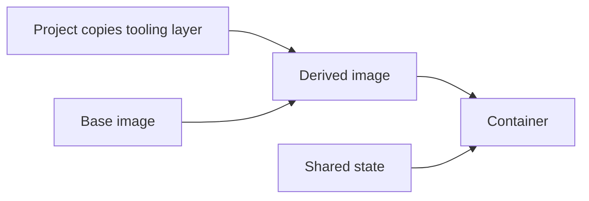

# Tooling layer examples

These examples are complete build contexts meant to be copied into a project's
`.claude-contained/layer/` directory. See [Tooling Layers](../../USAGE.md#tooling-layers)
for the launcher contract and confirmation behavior.

- [Java](java/README.md) provides a JDK, Maven, JBang, HotswapAgent, and JDT LS.

