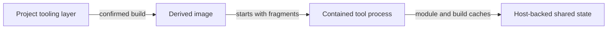

# Tooling-layer examples

Each subdirectory is a complete tooling-layer build context. Copy one into a
project's `.claude-contained/layer/` directory, then adjust its pinned versions
and checksums for that project.

- [Go](go/) installs a checksum-verified Go toolchain, persists its caches, and
  prevents automatic toolchain downloads.
- [Java](java/README.md) provides a JDK, Maven, JBang, HotswapAgent, and JDT LS.

Read [Tooling Layers](../../USAGE.md#tooling-layers) for the build confirmation,
derived-image identity, environment-fragment, and cleanup behavior.
